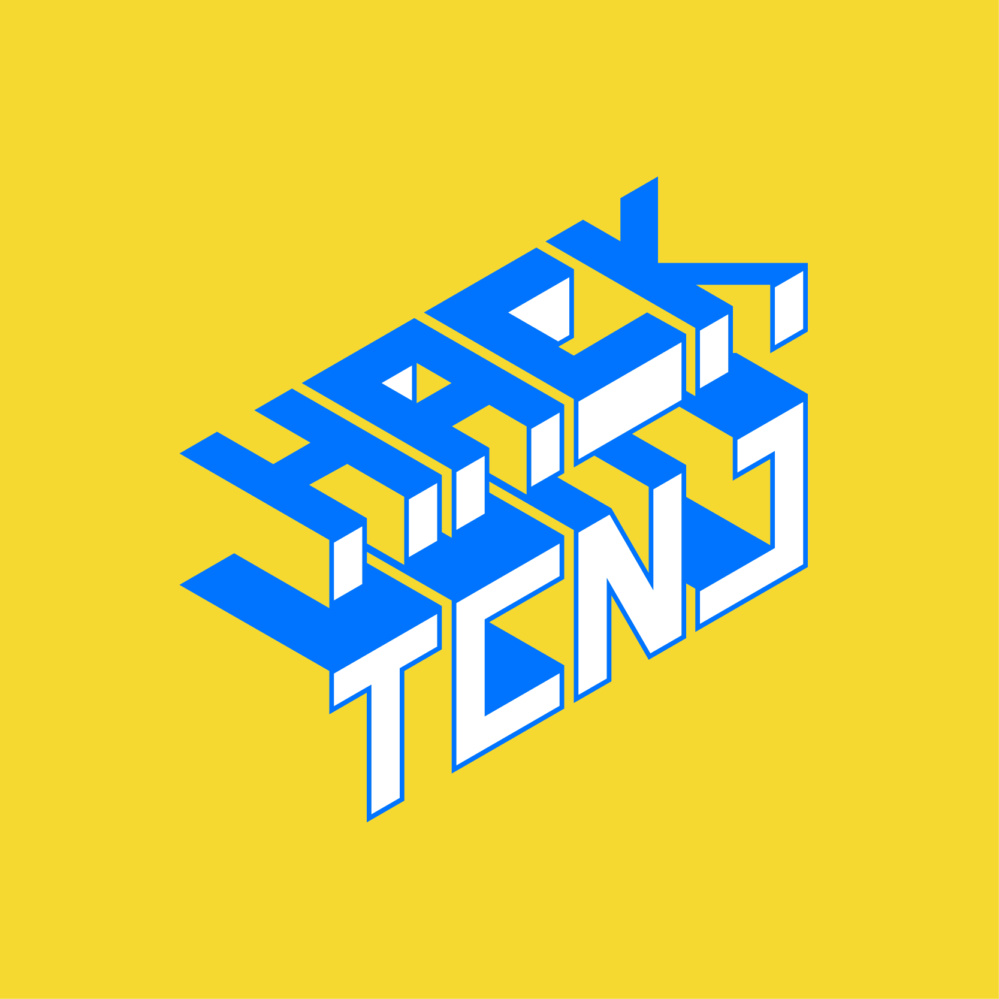
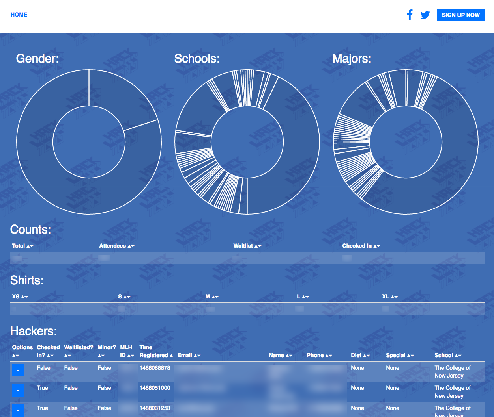
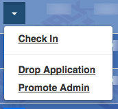

# chronicel
Our super sweet hacker management system for HackTCNJ 2017!

chronicel is a simple and minimal registration system made for HackTCNJ. It provides both hackers and organizers everything they need all in one place. HackTCNJ is a smaller, more personal hackathon, so we have no need for hacker applications, team registration, or reimbursement.



## Hacker's view:


## Organizer's view:



We wanted to provide our hackers the best registration experience we could.

**It also has a really nice system for organizers to work with MyMLH, this is what we would really love for others to build upon!**

## Used By:
* HackTCNJ 2017 & 2018
* Hack@WPI 2018

Let us know if you are using chronicel! Add yourself to this list with a PR!

## Design Requirements:
- Realtime Registration Updates
- Automatic Waitlist Management
- MyMLH Integration
- Resume Collection
- Mailchimp Integration
- Administrative Dashboard
- Check In
- Hacker Self Service ('Day Of' Dashboard, Update Info, Drop Application, Contact, View Past Emails)
- Error Reports & Metrics
- Slack Notifications for Organizers

## Setup:
- `git clone https://github.com/kbohinski/chronicel.git && cd chronicel`
- `pip3 install -r requirements.txt`
- Fill in all config files!
- Database: 
```sh
python3
```
```python
from flask_app import db
db.create_all()
```
- Automatic waitlist management setup: Setup your favorite cron like tool to run `python3 manage_waitlist.py` nightly!
- `python3 flask_app.py`
- 🎉 🔥 🙌 💃 👌 💯
